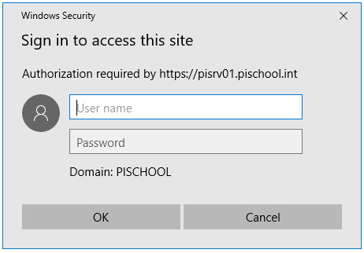

# Keycloak Kerberos Probe Plugin

This plugin for Keycloak detects if a client is capable of Kerberos authentication before attempting to authenticate them, avoiding unnecessary browser popups for non-domain-joined clients, anonymous browser mode etc.



## Features
- Checks if the client supports Kerberos using javascript.
- Skips Kerberos challenge for clients that cannot respond.
- Allows configuring probe timeout (default: 500ms).
- Integrates directly into Keycloak authentication flows.

**Note:** This plugin does not configure Kerberos itself — you must already have a working Keycloak Kerberos setup. It only provides an automated detection layer.

## Installation

### Download the JAR (releases) and place it into providers directory:
```
/opt/keycloak/providers/keycloak-krb-probe.jar
```


### Mounting JAR in Docker (default image)
```
docker run \
  -v $(pwd)/keycloak-krb-probe.jar:/opt/keycloak/providers/keycloak-krb-probe.jar \
  quay.io/keycloak/keycloak:26.3.1 \
```


### Mounting JAR with Bitnami Keycloak Operator
Add your JAR as a ConfigMap

```
kubectl create configmap keycloak-krb-probe \
  --from-file=keycloak-krb-probe.jar  
```

Mount it (helm values)

```
extraVolumes:  
  - name: krb-probe  
    configMap:  
      name: keycloak-krb-probe  
extraVolumeMounts:
  - name: krb-probe
    mountPath: /opt/bitnami/keycloak/providers/keycloak-krb-probe.jar
    subPath: keycloak-krb-probe.jar
``` 

Restart the Keycloak pod after mounting.

**Note:** Your keycloak deployment in k8s may vary, adjust the mounting to your needs

## Usage in Authentication Flow

1. Go to **Authentication** → **Flows** in Keycloak admin console a edit your **browser** flow.
2. Insert the `Kerberos Backchannel Probe` execution **between** cookie and Kerberos authenticator 
3. Set it to **ALTERNATIVE**.
4. Adjust probe timeout in the plugin configuration if needed (default 500ms).
5. Add subflow: Add flow → Kerberos Path; set **ALTERNATIVE**; this subflow will replace `Kerberos` execution
6. Inside Kerberos Path:
  1. Add Condition – Kerberos Capable Cookie (REQUIRED).
  2. Add execution - Kerberos (REQUIRED).

7. Keep Username Password Form after the subflow (fallback).


```
Browser
  ├─ Cookie                          (ALTERNATIVE)
  ├─ Kerberos Backchannel Probe      (ALTERNATIVE)   ← plugin (top-level)
  ├─ Kerberos Path                   (ALTERNATIVE)   ← subflow
  │    ├─ Condition - KRB_CAPABLE    (REQUIRED)
  │    └─ Kerberos                   (REQUIRED)
  ├─ Identity Provider Redirector    (ALTERNATIVE)   (optional)
  └─ Username Password Form          (ALTERNATIVE)
```

Key points for setting this up:

* Kerberos Path is a subflow inside Browser, set to ALTERNATIVE.

* The probe runs first, sets a KRB_CAPABLE cookie if Kerberos works.

* Condition step checks the cookie before attempting Kerberos.

* Kerberos step executes SPNEGO authentication.

* If probe fails or Kerberos fails → flow continues to Username/Password Form.

Deeper explanation of how plugin works can be find in [detailed flow diagram](docs/flow.md).